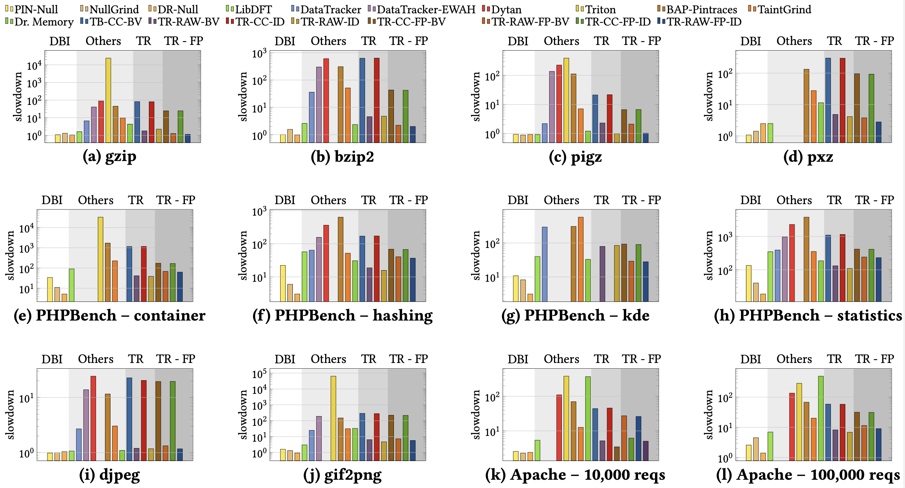

# Taint Evaluator

This is the version used to conduct our experiments for the paper titled "The Taint Rabbit: Optimizing Generic Taint Analysis with Dynamic Fast Path Generation" and presented at AsiaCCS 2020.

Taint Evaluator is a suite of experiments for assessing the performance of dynamic taint engines on x86 binary applications.

## Quick Links

* [Supported Taint Engines](#supported-taint-engines)
* [Supported Benchmarks](#supported-benchmarks)
* [How to Build](#how-to-build)
* [How to Run](#how-to-run)
* [Results](#results)
* [Adding your own Taint Engine](#adding-your-own-taint-engine)
* [Reporting Issues and Asking for Help](#reporting-issues-and-asking-for-help)
* [Additional Benchmarks](#additional-benchmarks)
* [Citation](#citation)
* [Licenses](#licenses)

## Supported Taint Engines

| Taint Engine      | Granularity     | Propagation                | Meta-Data            | DBI           |
| -------------     | -------------   | -------------              | -------------        | ------------- |
| [Taint Rabbit](https://github.com/Dynamic-Rabbits/Dynamic-Rabbits)       | Byte            | Generic                    | Pointer              | [DynamoRIO](https://github.com/DynamoRIO/dynamorio)     |
| [LibDFT](https://www.cs.columbia.edu/~vpk/research/libdft/)            | Byte            | Bitwise OR                 | Bit/Byte             | [PIN](https://software.intel.com/en-us/articles/pin-a-dynamic-binary-instrumentation-tool)           |
| [Dytan](https://www.cc.gatech.edu/~orso/papers/clause.li.orso.ISSTA07.pdf)             | Byte            | Union                     | Bit Vector           | [PIN](https://software.intel.com/en-us/articles/pin-a-dynamic-binary-instrumentation-tool)           |
| [Dr. Memory](https://github.com/DynamoRIO/drmemory)        | Byte            | Bitwise OR                 | 2 Bits               | [DynamoRIO](https://github.com/DynamoRIO/dynamorio)     |
| [DataTracker](https://research.vu.nl/ws/portalfiles/portal/1040158/dtracker-ipaw14.pdf)      | Byte            | Union                      | Set                  | [PIN](https://software.intel.com/en-us/articles/pin-a-dynamic-binary-instrumentation-tool)           |
| [DataTracker EWAH](https://www.cs.vu.nl/~giuffrida/papers/vuzzer-ndss-2017.pdf) | Byte            | Union                      | Compressed Arrays    | [PIN](https://software.intel.com/en-us/articles/pin-a-dynamic-binary-instrumentation-tool)           |
| [Taintgrind](https://github.com/wmkhoo/taintgrind)        | Byte            | Bitwise OR                 | Bit                  | [Valgrind](https://valgrind.org/)           |
| [Triton](https://github.com/JonathanSalwan/Triton)            | Byte            | Bitwise OR                 | Boolean              | [PIN](https://software.intel.com/en-us/articles/pin-a-dynamic-binary-instrumentation-tool)           |
| [BAP Pin-Traces](https://github.com/BinaryAnalysisPlatform/bap-pintraces)    | Byte            | Move                       | Integer              | [PIN](https://software.intel.com/en-us/articles/pin-a-dynamic-binary-instrumentation-tool)           |
| [DECAF](https://github.com/decaf-project/DECAF)    | Bit            | BITWISE OR                       | Bit              | [QEMU](https://www.qemu.org/)           |


## Performance Benchmarks

We support the following benchmarks:

* Command-Line Utilities (e.g., data compression and image parsing)
* [SPEC CPU 2017](https://www.spec.org/cpu2017)
* [PHPBench](https://github.com/phpbench/phpbench)
* [ApacheBench](https://httpd.apache.org/docs/2.4/programs/ab.html)

## How to Build

### System Requirements

Unfortunately, we have some strict requirements on the system used for running our experiments. While the Taint Rabbit runs on recent versions of Linux, many other taint engines, including LibDFT and Dytan, are dependent on Pin 2.14, which in turn, require an old version of the Linux Kernel (less than 4.x.x).

For example, following similar instructions to [here](https://www.tecmint.com/install-kernel-in-ubuntu/), one can install Linux 3.16 on a 32-bit Ubuntu machine accordingly:

1. First download kernel headers and image.
```
wget -c https://kernel.ubuntu.com/~kernel-ppa/mainline/v3.16.37/linux-headers-3.16.37-031637_3.16.37-031637.201608231033_all.deb
wget -c https://kernel.ubuntu.com/~kernel-ppa/mainline/v3.16.37/linux-headers-3.16.37-031637-generic_3.16.37-031637.201608231033_i386.deb
wget -c https://kernel.ubuntu.com/~kernel-ppa/mainline/v3.16.37/linux-image-3.16.37-031637-generic_3.16.37-031637.201608231033_i386.deb
```

2. Install the kernel. Note, one might need to install the `module-init-tools` package to get the following command to work.
```
sudo dpkg -i linux*.deb
```

3. Finally, reboot to switch to the installed kernel.
```
sudo reboot
```

### Dependencies

Given all of our considered benchmarks and taint engines, it is only natural to have somewhat many dependencies. 

Firstly, install general dependencies:

```
sudo apt-get install build-essential wget automake python cmake g++ g++-multilib libboost-dev \
                     libpython-dev libcapstone-dev zlib1g-dev libnuma-dev \
                     libxml2-dev autoconf bmagic autoconf libtool protobuf-compiler \
                     libprotobuf-dev libboost-filesystem-dev libcrypto++-dev
```

We also require that the following software is installed on your machine:

* [Z3Prover](https://github.com/Z3Prover/z3)
* [PIQI](http://piqi.org/doc/ocaml/) - for BAP Pin-Traces
* [EWAHBoolArray](https://github.com/lemire/EWAHBoolArray) - for DataTracker EWAH

To build the benchmarks, we require that the following software is installed on your machine:

- **Util Benchmarks**
```
sudo apt-get install gif2png pigz pxz bzip2 gzip 
```

**Note**:Taint Evaluator runs libjpeg and libjpeg-turbo. To minimise consfusion, Taint Evaluator downloads and compiles these benchmarks from source. See `benchmarks/util`

- **PHP Benchmarks**

Prior to entering `apt-get install`, one might need to add the following apt-get repository in order to obtain the needed packages:

```
sudo add-apt-repository ppa:ondrej/php
sudo apt-get update
```

Then, simply install the packages needed by PHPBench:

```
sudo apt-get install php7.2 composer php-mbstring php-xml
```

If the above does not work, you might need to build PHP 7.2 from source.

- **Apache Benchmarks**

```
sudo apt-get install libapr1-dev libaprutil1-dev
```

- **SPEC CPU 2017 Benchmarks**

We do not have the rights to distribute the SPEC CPU 2017 benchmarks. Details on how to install SPEC CPU 2017 are found [here](https://www.spec.org/cpu2017/Docs/install-guide-unix.html).

Taint Evaluator provides the packaged tools that we compiled for our experiments. The tools are located at: `benchmarks/my_tools-1.0.2.tar`. Details on how to use the packaged tools are found [here](https://www.spec.org/cpu2017/Docs/tools-build.html#package).

Crucially, once the SPEC CPU directory is set up and the package is located in the directory's `tools/bin`, one needs to install the package via the following command (where `install.sh` is provided by SPEC CPU):

```
install.sh -u my_tools
```

### Building Taint Evaluator

Once all of the dependencies are set up, the building of Taint Evaluator is made easy with two scripts, namely `set_paths.sh` and `download_and_build.sh`. The scripts do most of the work for you.

Execute the following commands:

1. Get the repository and enter its main directory.
```
git clone "https://github.com/johnfxgalea/Taint-Evaluator.git"
cd Taint-Evaluator
```
2. Set proc vars, such as turning off ASLR (which is required by VUzzer).
```
sudo source set_proc_vars.sh
```
3. Set up environment variables used by Taint Evaluator
```
source set_paths.sh
```
4. Finally download and build the repository.
```
source download_and_build.sh
```

**Note:** The downloading and building of benchmarks and tools might take some time. Please ensure you have a fast download speed.

## How to Run

Scripts for running performance benchmarks are found in the `experiments` directory from the main directory. For instance, to run the util benchmark, enter the following command:

```
bash run_util_benchmarks.sh
```

You may run other benchmarks in similar fashion. Note that for the Apache benchmark, one needs to run using sudo. In other words, enter the following command:

```
sudo -E bash run_apache_benchmarks.sh
```

By default, benchmark scripts have the commands for running taint engines commented out. Therefore, you need to modify the script in order to select which taint engine you want to consider in your experiment. In the future, we plan to add parameterization to our scripts.

```
#run_experiment "libdft"
#run_experiment "nullpin"
run_experiment "nulldynamorio"             # Uncommented to run this tool.
#run_experiment "taintgrind"
run_experiment "nullgrind"                 # Uncommented to run this tool.
#run_experiment "taint_bunny_bitwise_cc"
#run_experiment "taint_bunny_bitwise_in"
```

Upon the completion of an experiment, a new directory, called `results`, is created by Taint Evaluator to store the results. This directory is located in the main directory of the project, i.e., `$TAINT_EVALUATOR_DIR/results`. Note that running an experiment again will **overwrite** previous results.

Please ensure that CPU Scaling is turned off. This can be achieved by using [cpufrequtils](https://wiki.debian.org/CpuFrequencyScaling#With_cpufrequtils).

### Regarding DECAF

We do not provide scripts for DECAF directly because special scripting is not actually required. In particular, once one has a running guest, simply download and build Taint Evaluator, and start experiments under the native tool setting. One must not forget to switch on tainting (via the `enable_tainting` command in QEMU) prior to starting the experiments. It is also [recommended](https://github.com/decaf-project/DECAF/issues/81) to run in *TTY* mode to avoid overheads stemming from the GUI.

Information for building DECAF may be found [here](https://github.com/decaf-project/DECAF/wiki/Startup).

## Results

Numerical figures are found [here](https://docs.google.com/spreadsheets/d/1gAm7GJBB3Rl4bfTwWq-ITcNyVuRtTH2vQYYaS3n-OUk/edit?usp=sharing).




## Adding your own Taint Engine

1. Create a directory in `./engines` where your tool shall reside.
2. Inside the directory, create a script named `download_and_build.sh`. This script should download and build your tool automatically. Moreover, define a PATH variable that refers to the directory so that the installation of the tool may be done with respect to it's value, i.e., the tool must reside in the directory. The name of the variable is typically in the form of `{NAME_OF_TOOL}_DIR`. It must also be exported by updating `set_paths.sh`, which is found in in the main directory.
3. Modify `download_and_build.sh` in the main directory of Taint-Evaluator to execute your tool's `download_and_build.sh` script which you have just created.
4. Include a `handler` script of your tool for a given benchmark. For instance, if you want to run your tool against command line utilities, create a script in `experiments/utils`. Note the handler script needs to be named in the following form: `{NAME_OF_TOOL}_handler.sh`. Moreover, the script should echo the command for you tool to instrument and execute the application passed as a parameter. See other handler scripts to get a better idea.
5. Modify the `run_{NAME_OF_BENCHMARK}_benchmark.sh` script of the considered benchmark to include your tool for execution. This is achieved by simply adding the following command at the end of the script: `run_experiment "{NAME_OF_TOOL}"`.
6. Please ensure that your taint engine has an associated license. If needs be, add the license to the `licenses` folder found in the main directory of the project.

## Reporting Issues and Asking for Help

Please post any issues or queries on the GitHub Issues page. If you are asking a question, please have your issue title be in the form "Question: <title of your question>".

## Additional Benchmarks

Please raise issues if you believe we should consider other benchmarks, including binaries, for measuring performance. We are mainly interested in CPU-bound benchmarks, but we do have some tests where execution is bounded by IO. Focus is placed on x86 32-bit applications because they are supported by all considered taint engines.

## Citation

If you find Taint Evaluator useful, please cite our work:

```
@inproceedings{galeakroening_taint,
author = {Galea, John and Kroening, Daniel},
title = {The Taint Rabbit: Optimizing Generic Taint Analysis with Dynamic Fast Path Generation},
year = {2020},
isbn = {978-1-4503-6750-9/20/06},
publisher = {Association for Computing Machinery},
address = {New York, NY, USA},
url = {https://doi.org/10.1145/3320269.3384764},
doi = {10.1145/3320269.3384764},
booktitle = {Proceedings of the 15th ACM Asia Conference on Computer and Communications Security},
numpages = {15},
location = {Taipei, Taiwan}
}
```

## Licenses

Different taint engines and benchmarks are associated with different open-source licenses. The individual licenses of the software used by Taint Evaluator are found in the `licenses` directory.

